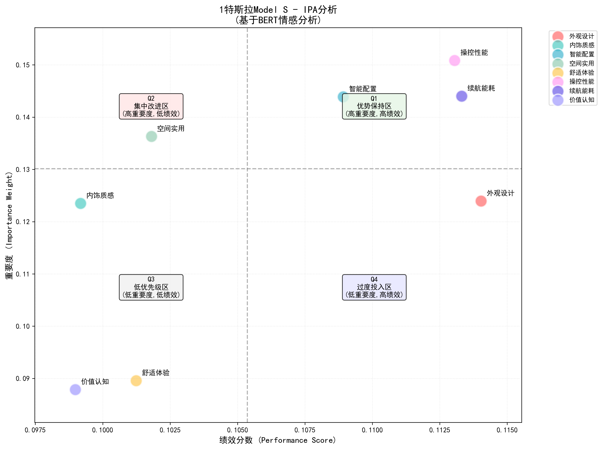
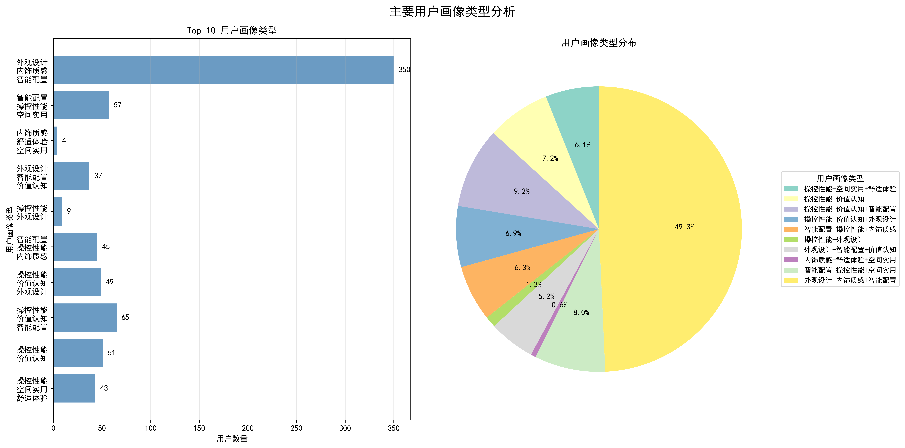

# SCSI-SLM: Consumer Voice to Engineering Insight

[](https://www.tandfonline.com/doi/full/10.1080/09544828.2026.2639933)


Official implementation for the paper:

**Mapping Consumer Voice into Engineering Insight: A Structured Language Model-Driven Design Support Framework for Electric Vehicles**

Published in *Journal of Engineering Design*  
Article page: https://www.tandfonline.com/doi/full/10.1080/09544828.2026.2639933  
DOI: https://doi.org/10.1080/09544828.2026.2639933

## Abstract
This repository contains the code, processed artifacts, and demo application for the SCSI-SLM framework. The project studies how large language models and structured retrieval can transform unstructured consumer reviews into engineering design insight for electric vehicles. The full pipeline includes:

1. structured semantic encoding of user reviews,
2. product-side and user-side modeling,
3. engineering knowledge graph construction,
4. a hybrid RAG application for interactive design support.

## Highlights
- End-to-end research pipeline from raw EV review data to engineering insight generation.
- Modular implementation aligned with the paper sections.
- Included processed outputs, analysis reports, figures, and a runnable RAG demo.
- Support for both vector retrieval and graph retrieval in the final application.

## Framework Overview


## Repository Structure
| Path | Paper Section | Purpose |
| --- | --- | --- |
| `00_Raw_Data/` | Sec. 3.1.1 | Raw consumer review datasets used in the study. |
| `01_SSE_Analysis/` | Sec. 3.1 | Data cleaning, LLM tag extraction, and engineering-dimension mapping. |
| `02_User_Modeling/` | Sec. 3.2 | Importance-performance analysis and user preference clustering. |
| `03_Knowledge_Graph/` | Sec. 3.3 | Neo4j-based engineering design knowledge graph construction. |
| `04_RAG_APP/` | Sec. 4.3 | Interactive hybrid retrieval and reasoning system. |
| `docs/images/` | Figures | Representative figures used in the manuscript and README. |

## Requirements
- Python 3.8+
- Docker and Docker Compose for Neo4j deployment
- OpenAI-compatible API key for LLM-powered steps
- Neo4j database for graph construction and graph retrieval

Install the Python dependencies from the project root:

```bash
pip install -r requirements.txt
```

Core dependencies include:
- `pandas`, `numpy`, `scikit-learn`
- `jieba`
- `matplotlib`, `seaborn`, `plotly`
- `langchain`, `langchain-openai`, `langchain-community`, `openai`
- `chromadb`, `neo4j`, `streamlit`

## Data and Artifacts
The repository includes both source data and intermediate outputs from the research workflow.

- Raw review data is stored in `00_Raw_Data/`.
- Cleaned review outputs are stored in `01_SSE_Analysis/1_Data_Preprocessing/outputs/`.
- User modeling outputs are stored under `02_User_Modeling/.../outputs/`.
- The knowledge graph module contains graph-building scripts and Neo4j setup files.

If you use the data or code in academic work, please cite the paper listed below.

## Reproducing the Pipeline
The project is organized as a staged workflow rather than a single training script.

### 1. Structured Semantic Encoding
This stage converts raw consumer reviews into structured engineering tokens.

Key scripts:
- `01_SSE_Analysis/1_Data_Preprocessing/cleaning_pipeline.py`
- `01_SSE_Analysis/2_Dimension_Construction/tag_extraction_refinement.py`
- `01_SSE_Analysis/2_Dimension_Construction/dimension_mapping.json`

Expected outputs:
- cleaned comments
- refined feature tags
- mapped engineering dimensions

### 2. Product and User Modeling
This stage derives both product-side and user-side signals from the structured review data.

Product-side analysis:
- `02_User_Modeling/Product_IPA_Analysis/ipa_quantification.py`
- outputs include `car_model_scores.csv`, `feature_statistics.json`, and per-model IPA figures

User-side analysis:
- `02_User_Modeling/User_Preference_Clustering/preference_profiling.py`
- `02_User_Modeling/User_Preference_Clustering/persona_visualization.py`
- outputs include user vectors, cluster characteristics, reports, and visualization figures

### 3. Knowledge Graph Construction
This stage organizes the extracted entities and relations into an engineering design knowledge graph.

Key files:
- `03_Knowledge_Graph/main.py`
- `03_Knowledge_Graph/scripts/init_database.cypher`
- `03_Knowledge_Graph/src/knowledge_graph_builder.py`
- `03_Knowledge_Graph/docker-compose.yml`

### 4. Hybrid RAG Application
The final stage exposes the research outputs through an interactive interface.

Key files:
- `04_RAG_APP/app.py`
- `04_RAG_APP/run.py`
- `04_RAG_APP/load_vector_data.py`
- `04_RAG_APP/core/rag_engine.py`

## Demo
To run the interactive application locally:

### 1. Configure environment variables
Create a root-level `.env` file based on `.env.example`.

Required variables include:
- `OPENAI_API_KEY`
- `NEO4J_URI`
- `NEO4J_USERNAME`
- `NEO4J_PASSWORD`
- `NEO4J_DATABASE`

### 2. Start Neo4j
From `04_RAG_APP/` or `03_Knowledge_Graph/`, start the database with Docker Compose:

```bash
docker-compose up -d neo4j
```

### 3. Initialize vector data if needed

```bash
cd 04_RAG_APP
python load_vector_data.py
```

### 4. Launch the app

```bash
cd 04_RAG_APP
streamlit run app.py
```

Or:

```bash
cd 04_RAG_APP
python run.py
```

The default web interface is available at `http://localhost:8501`.

## Representative Outputs
### Importance-Performance Analysis


### User Preference Clustering


### Hybrid RAG Interface


## Application Scenario
The SCSI-SLM framework supports multiple applications in electric vehicle product development.

Typical scenarios include:

- Product manager decision support based on consumer feedback
- Engineering design insight mining from large-scale reviews
- Knowledge-grounded product planning

## Related Projects
An example application prototype built on this framework:

**EV Product Manager Decision Support System (EV-PM-DSS)**

https://github.com/DonkeyKing01/EV-PM-DSS

## Reproducibility Notes
- This repository provides the full research pipeline as modular code and includes many intermediate outputs.
- Some stages rely on external LLM services and therefore require valid API credentials.
- The final demo depends on artifacts generated by the earlier modules and on a running Neo4j instance.
- Exact outputs may vary across model providers, prompts, or data versions.

## Citation
If you find this repository useful, please cite:

```bibtex
@article{Jin2026Mapping,
  title   = {Mapping Consumer Voice into Engineering Insight: A Structured Language Model-Driven Design Support Framework for Electric Vehicles},
  author  = {Qingyang Jin and Luyao Wang and Wenyu Yuan and Danni Chang},
  journal = {Journal of Engineering Design},
  year    = {2026},
  doi     = {10.1080/09544828.2026.2639933}
}
```
